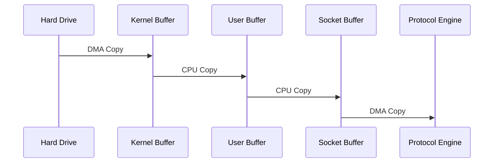
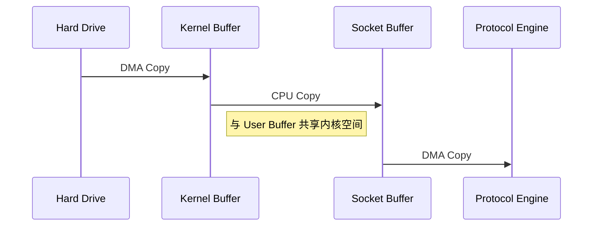
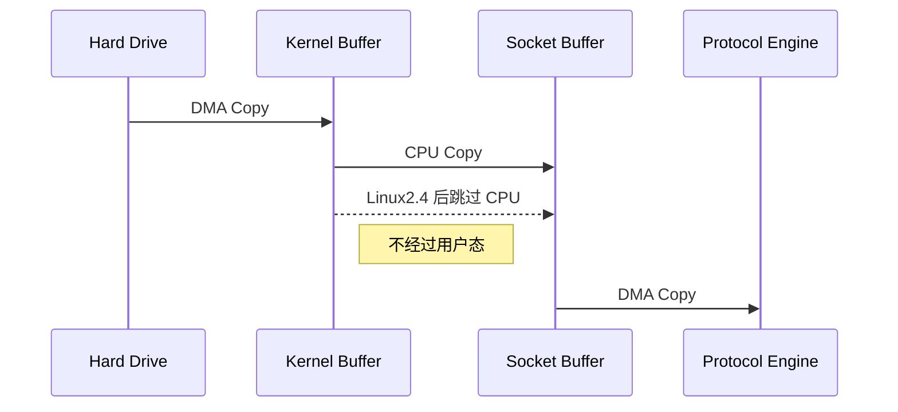

# Netty

核心基于 NIO 思想

## BIO(Blocking IO)
一个连接对应一个线程
每个连接的请求和响应都是同步阻塞进行的
没有 Buffer 只有输入流或输出流

## NIO(Non-Blocking IO)
多个连接对应一个线程
单个连接的请求和响应不独占线程
    线程拿到连接就去服务这个连接 没有拿到做自己的事
    对于线程来说是非阻塞的
通过事件 Event 去驱动

1. Selector(被观察者)
一个 Selector 对应一个线程
一个 Selector 对应多个 Channel
切换到哪个 Channel 由事件决定 

主要流程
    当前连接随着时间在变化(一秒为一次间隔)
    时间在变化 当前 Selector 负责的连接状态也在变化
    当前连接空闲时 注册在 Selector 的其他通道可以推送更新
        > 选择新的开始连接
        > 轮询(一次遍历)直到发现某一 Channel 有连接请求
        > 更新为最新连接 并清空本次遍历(如果有轻微断开)
        > 因为已经清空了 之后判断的又是当前连接进入下一次观察

2. Channel
一个 Channel 对应一个连接
多个 Channel 注册到 Selector中
返回操作系统情况
读写问题
    > Channel 的写表示将数据写到 Channel 中
    > Channel 的读表示从 Channel 中读出来写到其他地方

3. Buffer
Buffer 对应一个内存块 一个数组
据读写都通过 Buffer

### 文件 Copy

1. 传统 Copy

2. MMAP 内存映射

3. SendFile 优化

### 类比
> 这个例子不错

+ 同步阻塞 
    + 去理发店理发，一直等待理发师，直到轮到自己。
+ 同步非阻塞
    + 去理发店理发，每过一段一段时间看看是否轮到自己。
+ 异步非阻塞
    + 告诉理发师要理发，理发师有空后自己来找自己。

### 常见问题
断连重连 网络闪断 半包读写 失败缓存 网络拥塞 异常流
    > RTSP:视频流协议

## Reactor

### I/O 复用结合线程池，就是 Reactor 模式基本设计思想，如图

1. 通过事件驱动将客户端连接分派到不同的线程处理
分发者 ServiceHandler (此时为观察者)依据事件交由不同的线程处理
    > 不同的 Client 可以发送相同的事件
    > 此时对于观察者来说是相同的处理
    > 达到了I/O 复用的目的

2. 各个处理线程观察 ServiceHandler 是否分发的是自身可以处理的事件
    > 此时 ServiceHandler 是被观察的对象

### 单 Reactor 单线程
只有一个线程，无法完全发挥多核 `CPU` 的性能。
线程意外终止，或者进入死循环，会导致整个系统通信模块不可用。

### 单 Reactor 多线程
充分的利用多核 `cpu` 的处理能力
`Reactor` 承担所有的事件的监听和响应，它是单线程运行。

### 主从 Reactor 多线程
主 Reactor 只处理连接事件 Accept
从 Reactor 处理实际请求与业务处理

## Netty 的架构

### 工作原理示意图3 - 详细版

每个 Channel 都有且仅有一个 ChannelPipeline 与之对应

私聊系统使用 HashMap 会导致线程不安全
[HashMap](https://www.jianshu.com/p/e2f75c8cce01)

### 应用
http 与 websocket
[模板实例](/Users/hanwenhao/IdeaProjects/NettyTemplate/Http)

### 传输层

1. Protobuf
> 使用proto文件构建传输数据

2. 编码器(解码器)
ProtobufEncoder() 以及其它编码器
根据数据类型设置传输长度 避免粘包

3. 粘包拆包
通过消息协议统一长度可以解决粘包拆包问题
