# 网络协议

## 物理层

在物理信道（机械、电子、定时接口通信信道）上实现原始比特流的传输

1. 电话网络modems-V。92
2. IRDA物理层
3. USB物理层
4. EIARS-232，EIA-422，EIA-423，RS-449，RS-485
5. Ethernet physical layerIncluding10BASE-T，10BASE2，10BASE5，100BASE-TX，100BASE-FX。100BASE-T，1000BASE-T，1000BASE-SX还有其他类型
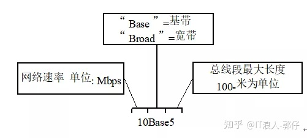
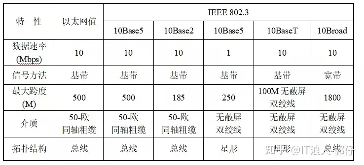

6. Varieties of802。11Wi-Fi物理层
7. DSL（DSL包括ADSL(Asymmetric Digital Subscriber Line，非对称数字用户线)、RADSL、HDSL和VDSL等等）
8. ISDN（综合业务数字-Integrated Services Digital Network）
9. T1 and otherT-carrierlinks， and E1 and otherE-carrierlinks
10. SONET/SDH：SONET （Synchronous Optical Network）同步光纤网络。
11. Optical Transport Network（OTN）：是以波分复用技术为基础、在光层组织网络的传送网，是下一代的骨干传送网。
12. GSMUm air interface物理层
13. Bluetooth物理层
14. ITURecommendations: seeITU-T
15. IEEE 1394 interface
16. TransferJet物理层：无线传输技术
17. Etherloop
18. ARINC 818航空电子数字视频总线：现有民航客机的机载无线电系统均为arinc公司。发动机数据传输的acarcs系统也由它来提供
19. G。hn/G。9960物理层
20. CAN bus（controller area network）物理层

## 数据链路层

物理寻址，同时将原始比特流转变为逻辑传输线路。

> 承接物理层
1. IEEE 802.2
802.2 是对数据链路层上层逻辑链路控制 (LLC)连接的建立和管理的规范。

2. Ethernet v.2
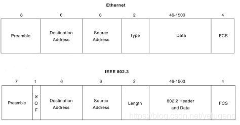

> 隧道协议
3. PPP
点到点协议（Point to Point Protocol，PPP）是为在同等单元之间传输数据包这样的简单链路设计的链路层协议。

4. L2F
二层转发协议（Layer 2 Forwarding Protocol）L2F协议本身并不提供加密或保密；它依赖于协议被传输以提供保密，专为隧道点对点协议（PPP）通信。

5. PPTP
点对点隧道协议（英语：Point to Point Tunneling Protocol，缩写为PPTP）是实现虚拟专用网（VPN）的方式之一。
+ 建立在PPP(Point to Point)点对点协议上的VPN隧道技术
+ 当远程用户要访问公司专用网时，可采用PPTP网络接入方式
    + 用户先拨号到PPTP Server建立PPP连接，PPTP Client和Server之间建立TCP连接，
    + 然后通过PPTP协商建立一条用户到服务器的隧道，然后通过PPP协议的NCP协商，为用户分配一个网段内IP，
    + 用户可以使用分配到的IP进行局域网（实际上只是逻辑上的局域网， 有可能地理位置跨越很大）内的通信。从而为远程接入虚拟专用网提供一条在公共网络上创建安全连接的途径。

报文分类
+ PPTP控制报文
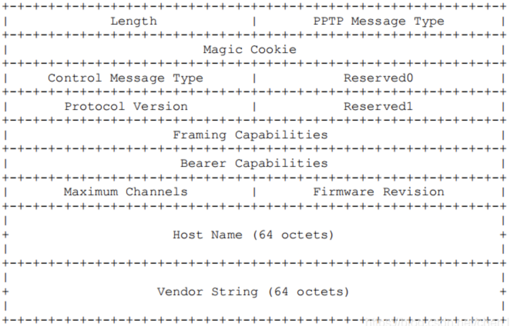
+ PPTP数据报文
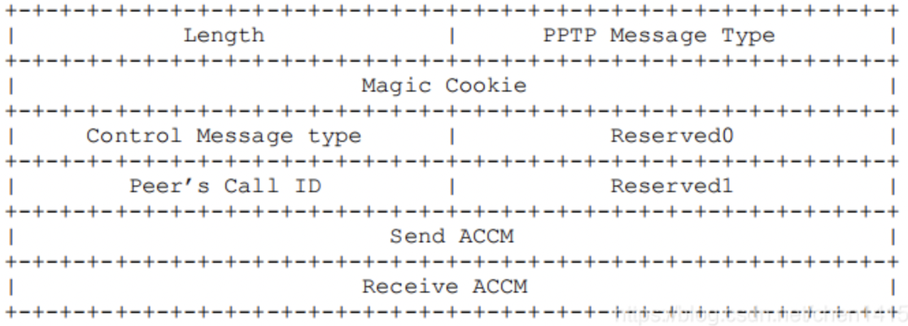

6. L2TP
第二层隧道协议（英语：Layer Two Tunneling Protocol，缩写为L2TP）是一种虚拟隧道协议，也是实现虚拟专用网（VPN）的方式之一。
+ 网络组件包括以下三个部分
    + 远端系统
        + 远端系统是要接入 VPDN 网络的远地用户和远地分支机构，通常是一个拨号用户的主机或私有网络的一台路由设备。
    + LAC（L2TP Access Concentrator，L2TP 访问集中器）
        + LAC 是附属在交换网络上的具有 PPP 端系统和 L2TP 协议处理能力的设备，通常是一个当地 ISP的 NAS，主要用于为 PPP 类型的用户提供接入服务。
        + LAC 作为 L2TP 隧道的端点，位于 LNS 和远端系统之间，用于在 LNS 和远端系统之间传递信息包。它把从远端系统收到的信息包按照 L2TP 协议进行封装并送往 LNS，同时也将从 LNS 收到的信息包进行解封装并送往远端系统。
        + LAC 与远端系统之间采用本地连接或 PPP 链路，VPDN 应用中通常为 PPP 链路。
    + LNS（L2TP Network Server，L2TP 网络服务器）
        + LNS 既是 PPP 端系统，又是 L2TP 协议的服务器端，通常作为一个企业内部网的边缘设备。
        + LNS 作为 L2TP 隧道的另一侧端点，是 LAC 的对端设备，是 LAC 进行隧道传输的 PPP 会话的逻辑终止端点。通过在公网中建立 L2TP 隧道，将远端系统的 PPP 连接的另一端由原来的 LAC 在逻辑上延伸到了企业网内部的 LNS。

> 压缩
7. XTP
压缩传输协议

> 转发
8. DCAP
数据转接客户访问协议

> 地址解析(在windows中属于网络层)
9. ARP
地址解析协议，即ARP（Address Resolution Protocol）是根据IP地址获取物理地址的一个TCP/IP协议
在任何时候，一台主机有IP数据报文发送给另一台主机，它都要知道接收方的逻辑（IP）地址。但是IP地址必须封装成帧才能通过物理网络。这就意味着发送方必须有接收方的物理（MAC）地址，因此需要完成逻辑地址到物理地址的映射。而ARP协议可以接收来自IP协议的逻辑地址，将其映射为相应的物理地址，然后把物理地址递交给数据链路层。
+ ARP报文格式
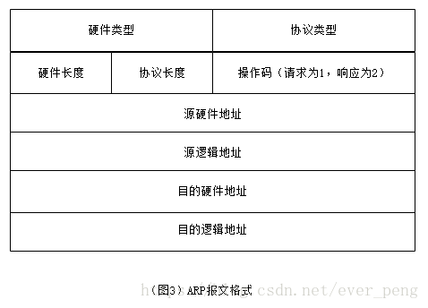

10. RARP
反向地址转换协议（RARP：Reverse Address Resolution Protocol） 允许局域网的物理机器从网关服务器的 ARP 表或者缓存上请求其 IP 地址
+ RARP协议的工作过程
    + 主机发送一个本地RARP广播，在广播包中，声明自己的MAC地址并且请求任何收到此请求的RARP服务器分配一个IP地址。
    + 本地网段的RARP服务器收到此请求后，检查器RARP列表，查找该MAC地址对应的IP地址。
    + 如果存在，RARP服务器就给源主机发送一个响应数据包，并将IP地址提供给对方主机使用。
    + 如果不存在，RARP服务器对此不做任何响应。
+ RARP图示
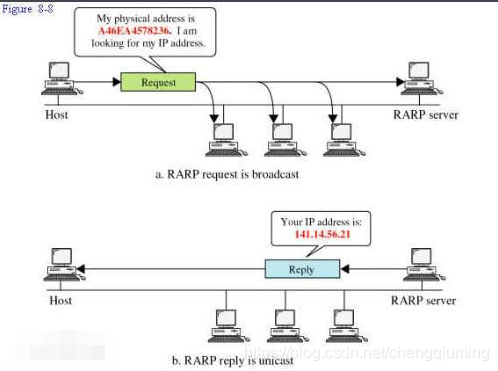

## 网络层
控制子网的运行，如逻辑编址、分组传输、路由选择

> 互联网协议
1. IPv4
网际协议版本4（英语：InternetProtocolversion4，IPv4），又称互联网通信协议第四版，是网际协议开发过程中的第四个修订版本。
IPv4使用32位（4字节）地址 如 127.0.0.1，全0代表网络地址(网关)，全1代表广播地址。
+ 地址类型
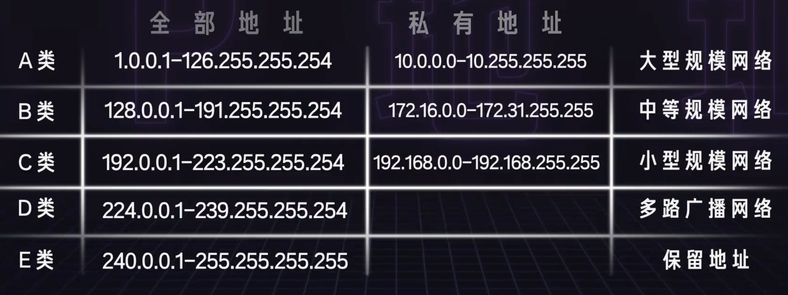
+ 帧格式

2. IPv6
相比于IPv4解决网络地址资源数量的问题，而且也解决了多种接入设备连入互联网的障碍。
+ 地址结构
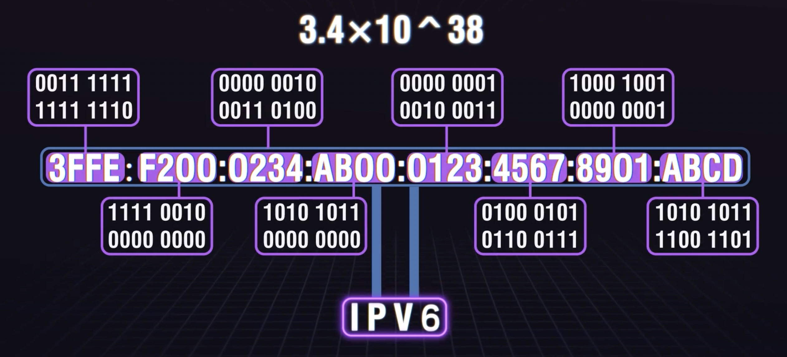
+ 帧格式
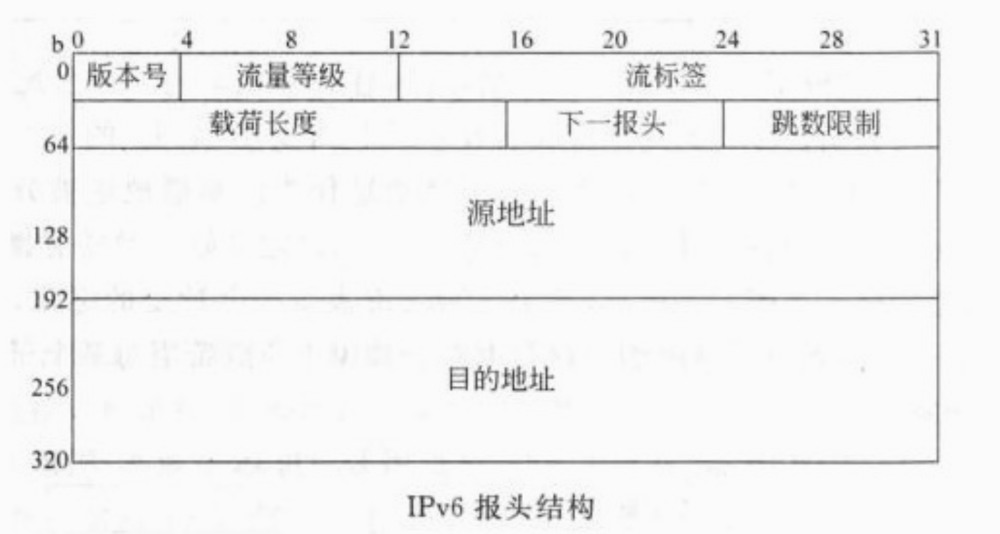

> 互联网控制
3. IGMP
IGMP是Internet Group Management Ptotocol的简称，被称为互联网组管理协议，是TCP/IP协议族中负责IPV4组播成员管理的协议。
+ IGMP工作图
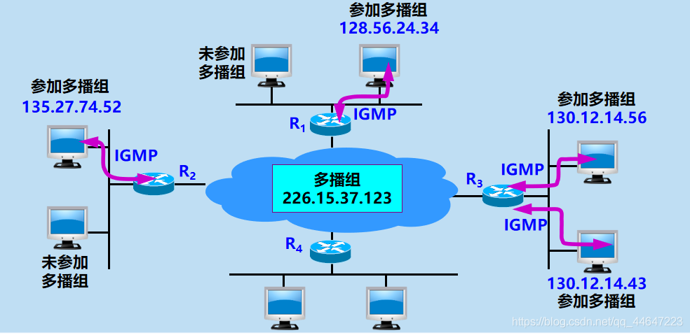

4. ICMP
ICMP（Internet Control Message Protocol）Internet控制报文协议。它是TCP/IP协议簇的一个子协议，用于在IP主机、路由器之间传递控制消息。
ICMP协议的类型分为两大类，查询报文和差错报文
+ 帧格式
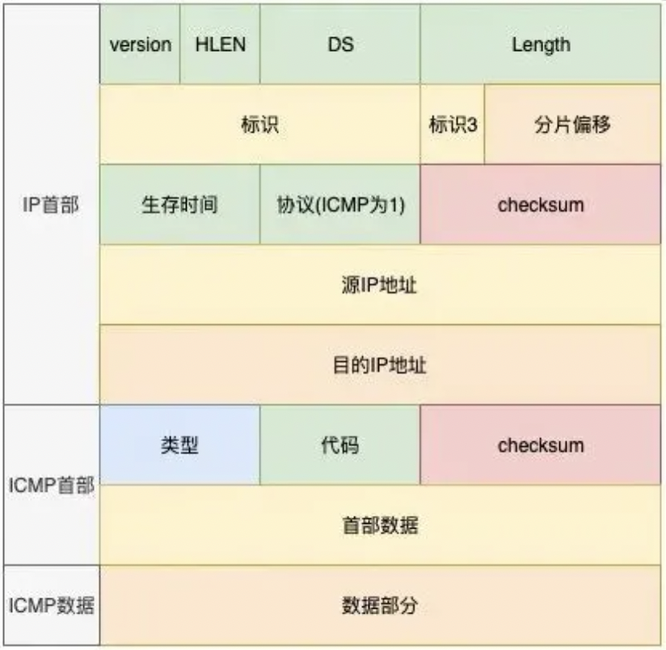

5. ICMPv6
ICMPv6为了与IPv6配套使用而开发的互联网控制信息协议。
+ 帧格式
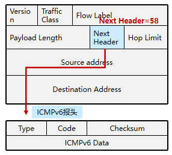

> 安全协议
6. AH
Authentication Header（AH）—— 认证头标，是用以保证数据包的完整性和真实性

7. ESP
ESP，封装安全载荷协议(Encapsulating SecurityPayloads)，是一种Ipsec协议，用于对IP协议在传输过程中进行数据完整性度量、来源认证、加密以及防回放攻击。
+ IPSec体系结构
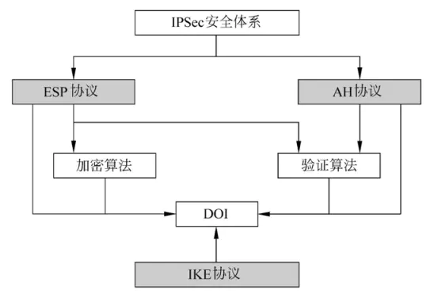

> 路由协议
8. RIP
RIP 路由信息协议 (Routing Information Protocol)
基于距离矢量算法的路由协议，利用跳数来作为计量标准。
+ rip报文结构

+ rip2报文结构(原结构用metric表示代价)
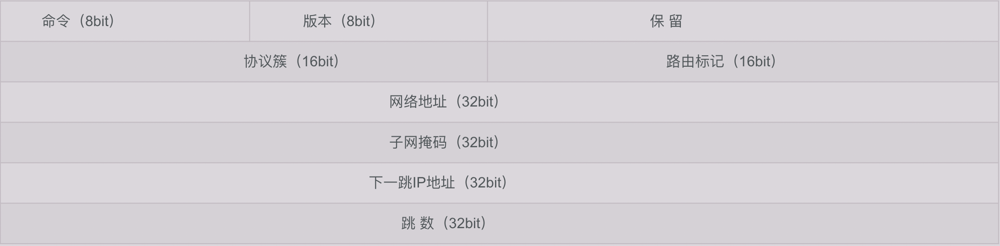

9. RIPng for IPv6
IPv6路由信息协议
RIPng使用UDP的521端口（RIP使用520端口）发送和接收路由信息。
RIPng的目的地址使用128比特的前缀长度（掩码长度）。
RIPng使用128比特的IPv6地址作为下一跳地址。
RIPng使用链路本地地址FE80::/10作为源地址发送RIPng路由信息更新报文。
RIPng使用组播方式周期性地发送路由信息，并使用FF02::9作为链路本地范围内的路由器组播地址。
RIPng报文由头部（Header）和多个路由表项RTEs（Route Table Entry）组成。在同一个RIPng报文中，RTE的最大数目根据接口的MTU值来确定。
+ RIPng 报文格式
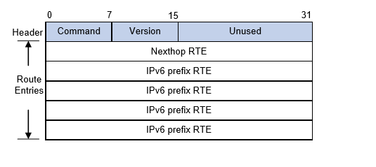
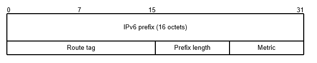

10. NHRP
下一跳解析协议
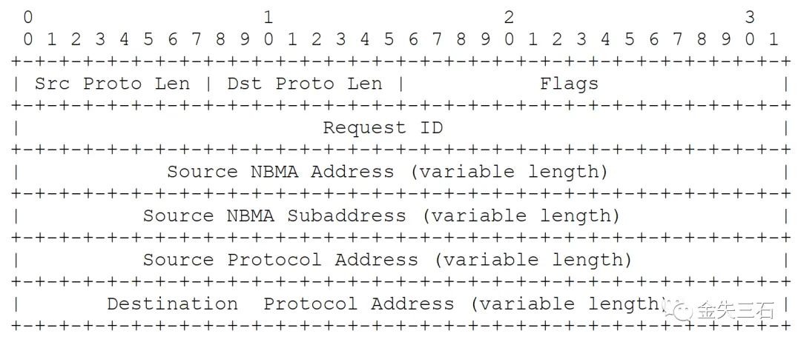

11. EGP
外部网关协议（Exterior Gateway Protocol）是AS(路由信息)之间使用的路由协议
允许自治系统之间两个网关主机间交换路由信息的协议。

12. IGP
内部网关路由协议
单个自治系统内部交换路由信息的协议。

13. GGP
网关到网关协议

14. PIM-DM
密集模式

15. OSPF
开放最短路径优先协议

16. IPX
互联网分组交换协议(Internetwork Packet Exchange protocol)，提供分组寻址和选择路由的功能，保证可靠到达，相当于数据报的功能

## 传输层
接受上一层的数据，在必要的时候把数据进行分割，并将这些数据交给网络层，且保证这些数据段有效到达对端

1. TCP
传输控制协议（TCP，Transmission Control Protocol）是为了在不可靠的互联网络上提供可靠的端到端字节流而专门设计的一个传输协议。
+ 三次握手和四次挥手
    + 双方都收到应答时，双方自身的SYN都进入Establish状态
    + 关闭连接时Client端可以立马关闭，服务端还在接受某个滑动窗口的数据
    + 服务端接受完成后，向客户端发送关闭的FIN请求，所以需要四次挥手
    + RTT超时则重传 (滑动窗口)
    + 拥塞控制的算法有四种，慢开始(slow-start)、拥塞避免(congestion avoidance)、快重传(fast retransmit)和快恢复(fast recovery)
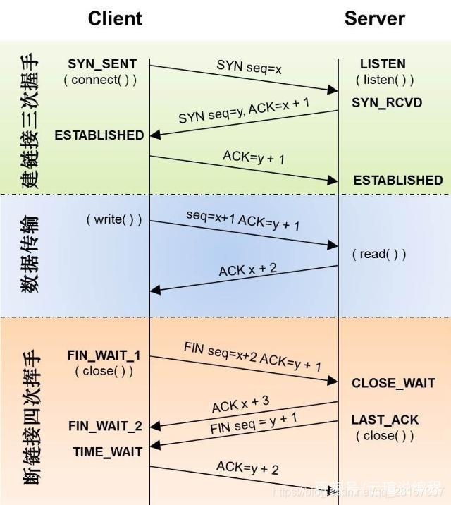

+ 有限状态机 (底层代码实现逻辑)
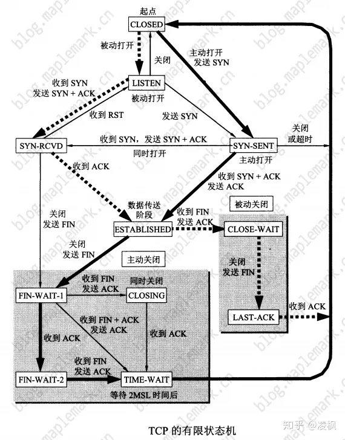

+ TCP 帧格式
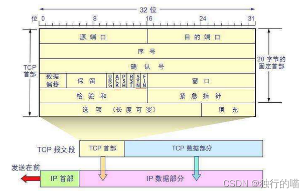

2. UDP
UDP（User Datagram Protocol，用户数据报协议）
UDP是传输层的协议，功能在IP的数据报服务之上增加了最基本的服务：复用和分用以及差错检测。
+ 无连接传输，减少维护连接的开销,但不可靠可能会丢包
+ 没有拥塞控制 也不关心拥堵 丢就丢了
+ 计算校验和校验通过则发送
+ UDP 帧格式
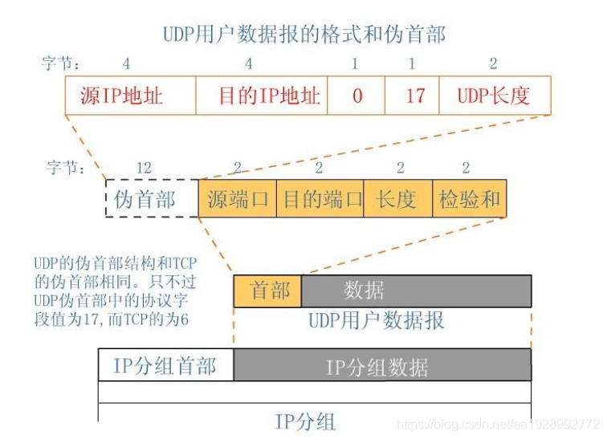

+ 校验和
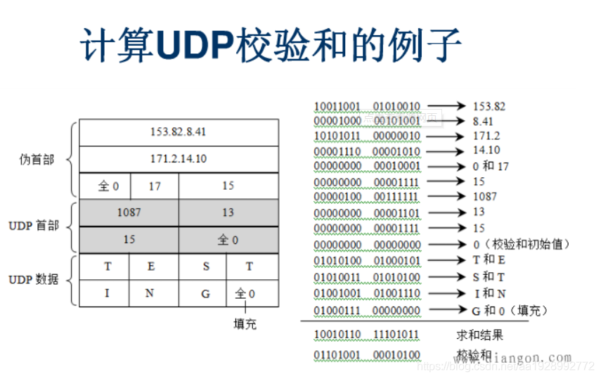

3. DECRPC
和一般的RPC不同 属于Windows基础系统的通信协议 处于传输层

4. MSRPC
MSRPC (MicroSoft Remote Procedure Call，微软远程过程调用) 是对 DCERPC 在 Windows 系统下的重新改进和实现

5. XOT
基于 TCP 协议的 Cisco X.25（XOT）

6. Van Jacobson
压缩TCP协议

7. TALI
传输适配层接口协议

8. RUDP
可靠的用户数据报协议，在UDP上加一层可靠传输
某些情境下可以降低延时

9. Mobile IP
移动IP（Mobile IP，MIP）协议，允许移动节点（不限于手机）在不改变IP地址的情况下可以从一个子网移动到其他子网

## 会话层
不同机器上的用户之间建立及管理会话

1. NetBIOS
NetBIOS，(NetBIOS Services Protocols 网络基本输入/输出系统协议)。
承接传输层 相对底层的会话协议，TCP相关应用都要用到
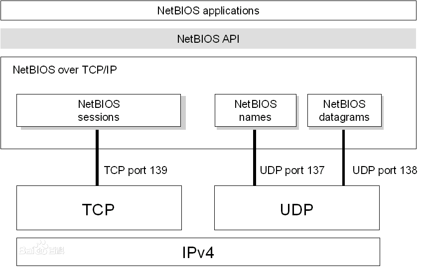

2. SMB
SMB（Server Message Block）通信协议
SMB使用了NetBIOS的应用程序接口
SMB 是在会话层（session layer）和表示层（presentation layer）以及小部分应用层（application layer）的协议。

3. RPC
远程过程调用(Remote Procedure Call Protocol)协议
RPC协议假定某些传输协议的存在，如TCP或UDP，为通信程序之间携带信息数据。在OSI网络通信模型中，RPC跨越了传输层和应用层。RPC使得开发包括网络分布式多程序在内的应用程序更加容易。
+ RPC报文头
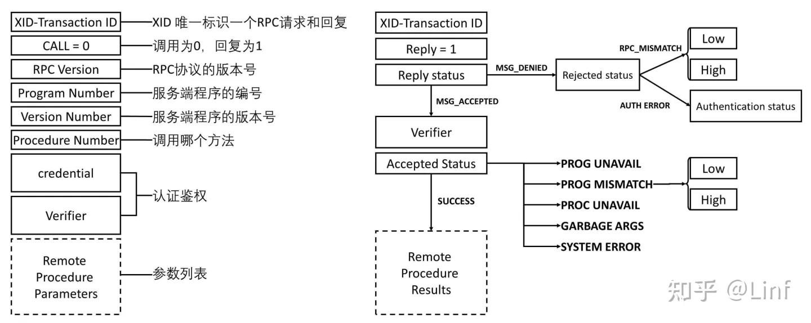

4. SSL
SSL协议(Secure Socket Layer，安全套接层)主要是使用公开密钥体制和x：509数宇证书技术保护信息传输的机密性和完整性。
当前普遍采用OpenSSL中的RSA算法解决

5. TLS
传输层安全性协议（Transport Layer Security），是一种安全协议，目的是为互联网通信提供安全及数据完整性保障
在SSL基础上增强了其功能

6. DAP
即调试适配协议( Debug Adapter Protocol )，用来对多种调试器进行抽象统一的适配层

7. LDAP
Lightweight Directory Access Protocol，「轻量目录访问协议」
解决了细粒度的权限控制，即「谁 以什么权限 访问什么」。

## 表示层
信息的语法语义以及它们的关联，如加密解密、转换翻译、压缩解压缩

1. LPP
轻量级表示协议(Lightweight Presentation Protocol)
描述了在某些受限条件下提供基于 TCP/IP 网络的 OSI应用程序服务的支持方法。

2. XDP
XDP （eXpress Data Path）是内核中提供的处理网络包的一个位置。我们可以在网络栈中的XDP的地方使用eBPF程序，对网络包进行一些较为简单的操作。

3. 数据格式都属于表示层
如 ASCII、PICT、TIFF、JPEG、MIDI、MPEG

## 应用层

> TCP 相关应用协议
1. HTTP
超文本传输协议（Hyper Text Transfer Protocol，HTTP）是一个简单的请求-响应协议，它通常运行在TCP之上。
+ 请求报文

+ 响应报文

2. SMTP
简单邮件传输协议(Simple Mail Transfer Protocol)，是一种提供可靠且有效的电子邮件传输的协议
+ 报文格式

3. POP3
邮局协议版本3 (Post Office Protocol - Version 3)它被用户代理用来邮件服务器收发邮件
+ 报文格式
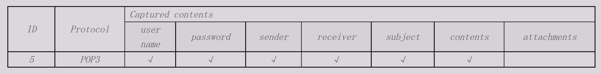

4. IMAP
因特网消息访问协议(Internet Message Access Protocol)主要作用是邮件客户端可以通过这种协议从邮件服务器上获取邮件的信息，下载邮件等。当前的权威定义是RFC3501。
+ 报文格式
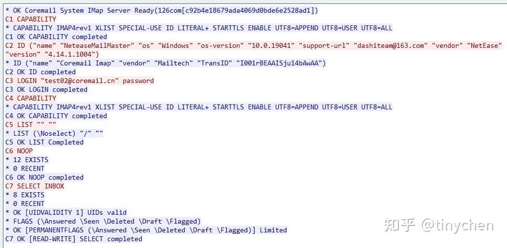

5. TELNET
远程终端协议
+ Telnet协议的主体由三个部分组成
    + 网络虚拟终端（NVT，Network Virtual Terminal）的定义
    + 操作协商定义
    + 协商有限自动机

6. Finger
Finger既是协议名也是应用程序名，最早产生于UNIX，通过它可以查询互联网上主机或用户的状态。

7. NNTP
网络新闻传输协议(Network News Transfer Protocol)，NNTP用于向Internet上NNTP服务器或NNTP客户（新闻阅读器）发布网络新闻邮件的协议

> UDP 相关应用协议
8. BOOTP
BOOTP（Bootstrap Protocol，引导程序协议）BOOTP用于无盘工作站的局域网中，可以让无盘工作站从一个中心服务器上获得IP地址。
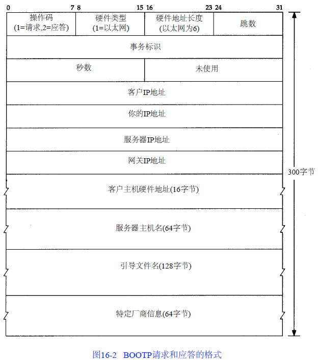

9. DHCP
DHCP（Dynamic Host Configuration Protocol，动态主机配置协议），前身是BOOTP协议，是一个局域网的网络协议，使用UDP协议工作，统一使用两个IANA分配的端口：67（服务器端）、68（客户端），自动给内网机器分配IP地址等信息的协议。
+ 报文分类
    + Discover、Offer、Request、ACK、NAK、Release、Decline、Inform
+ 报文格式
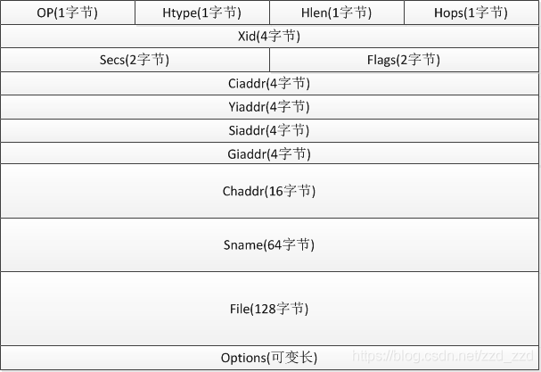
+ 时序图
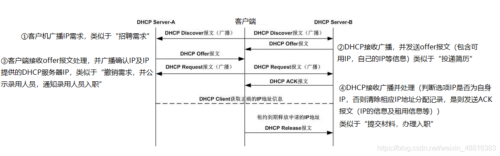

10. NTP
网络时间协议(Network Time Protocol) 用来使计算机时间同步化的一种协议，它可以使计算机对其服务器或时钟源（如石英钟，GPS等等)做同步化，它可以提供高精准度的时间校正（LAN上与标准间差小于1毫秒，WAN上几十毫秒）
+ 同步示意图
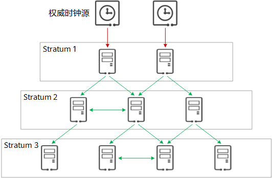

> 同时使用TCP和UDP的服务
11. SOCKS
防火墙安全会话转换协议 （Socks: Protocol for sessions traversal across firewall securely） socks协议的设计初衷是在保证网络隔离的情况下，提高部分人员的网络访问权限，但是对应网络安全来讲，更多的是利用socks5这个协议来访问到内部的网络，访问一些访问不到的资源

12. DNS
域名系统（Domain Name System，缩写：DNS）是互联网的一项服务。它作为将域名和IP地址相互映射的一个分布式数据库，能够使人更方便地访问互联网。
+ 域名分类
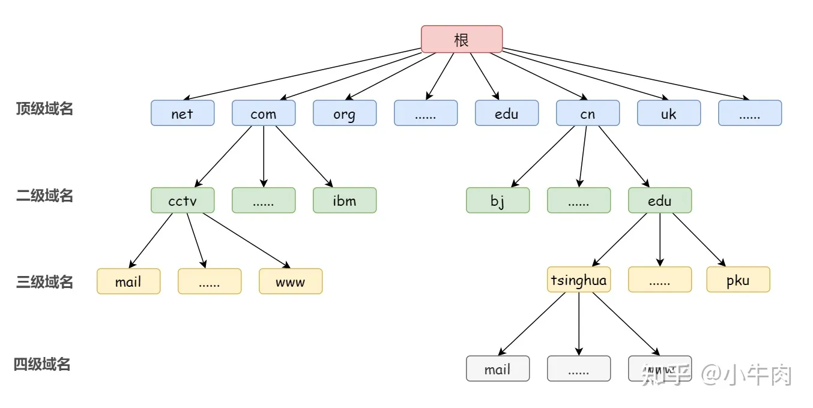
+ 域名查询过程
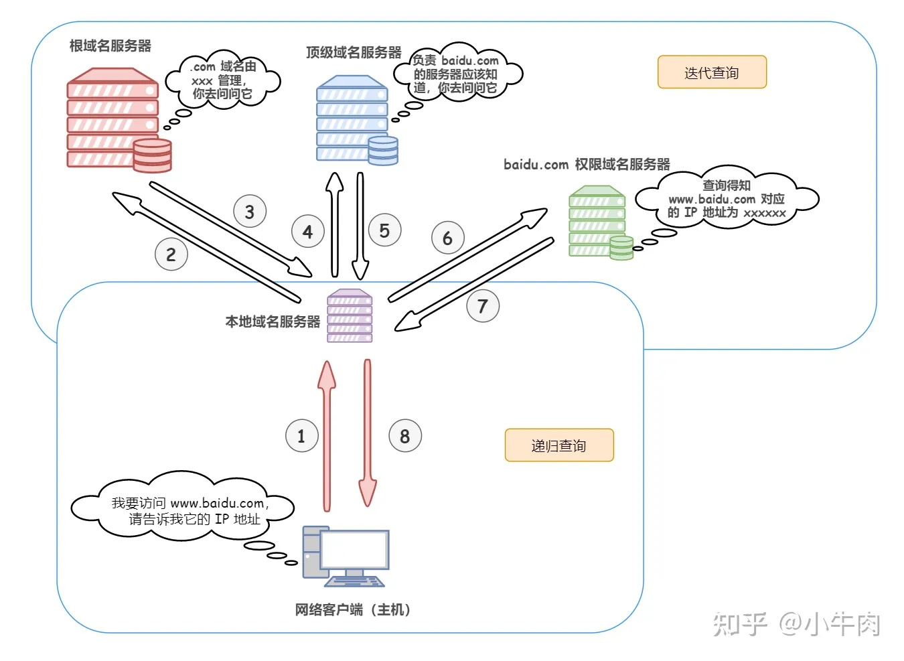
+ DNS帧格式
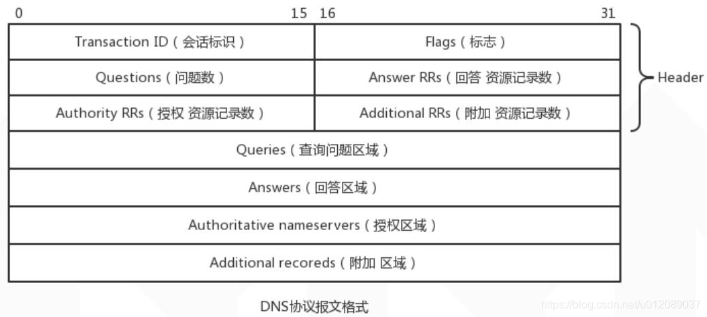

13. SLP
服务定位协议（SLP：Service Location Protocol）为网络服务的发现和选择提供一种可扩展构架。

> 文件相关
14. FTP
FTP（File Transfer Protocol，文件传输协议） 是 TCP/IP 协议组中的协议之一。
FTP使用了两个并行的TCP来传输文件：一个是控制连接（port:21），一个是数据连接(port:20)。控制连接用于在两个主机之间传输控制信息，如口令，用户标识，存放、获取文件等命令。数据连接用于实际发送一个文件,发送完文件之后数据连接会关闭。

+ FTP命令

+ 主动模式
 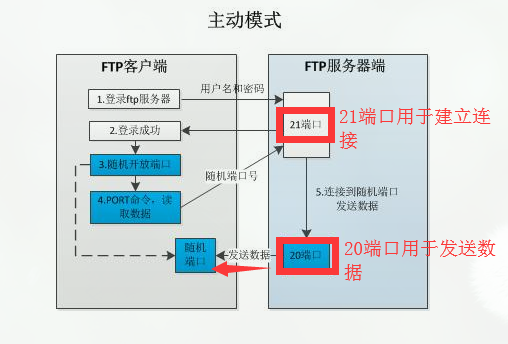
+ 被动模式
 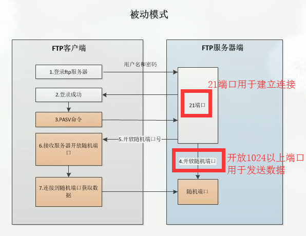

15. NFS
网络文件系统(Network File System)NFS的通信协议以RPC为基础操作方式。远程过程调用RPC是指调用远处非本地的过程，它提供了一个设备可以对在其他设备上运行的进程进行过程调用。
+ NFS通信结构
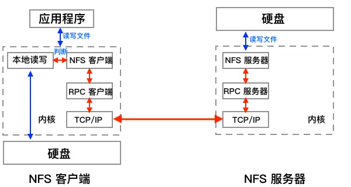

16. TFTP
TFTP（Trivial File Transfer Protocol,简单文件传输协议）

17. NTF HP
网络文件传输协议

> 网络服务
18. VT
虚拟终端仿真协议

19. RDA HP
远程数据库访问协议

20. LPR/RAW
网络打印协议之LPR与RAW、打印机端口RAW-TCP9100与LPR-TCP515
+ Raw： 是可与 Windows 一起使用的协议。其数据传输速度高于 LPR
+ LPR： 是 TCP/IP 常用的协议

21. RLogin/RSH/SSH
+ 远程登录（rlogin）是一个UNIX命令，它允许授权用户进入网络中的其它UNIX 机器并且就像用户在现场操作一样。
+ Rsh 是远程外壳(remote shell) 的缩写(外壳是操作系统的一种命令接口)
+ 安全外壳协议（Secure Shell，简称SSH）是一种在不安全网络上用于安全远程登录和其他安全网络服务的协议。

| 服务   | 是否需要密码 | 是否明文 | 功能                                  | 端口 |
|--------|--------------|----------|---------------------------------------|------|
| rlogin | 是           | 是       | 远程登录得到shell                     | 513  |
| rsh    | 是           | 是       | 可远程执行命令，也可远程登录得到shell | 514  |
| ssh    | 是           | 否       | 可远程执行命令，也可远程登录得到shell | 22   |

## LTE
长期演进(Long Term Evolution)，表示移动互联网从3G向4G、5G演变，范指移动互联网时代。
+ 移动互联网图示
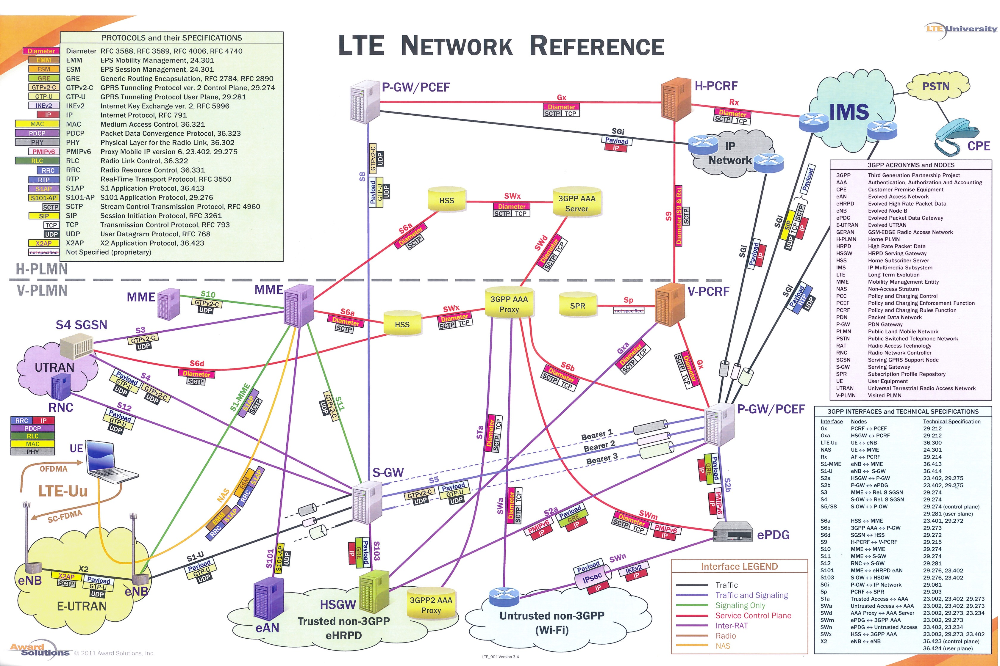

## 整体结构导图

